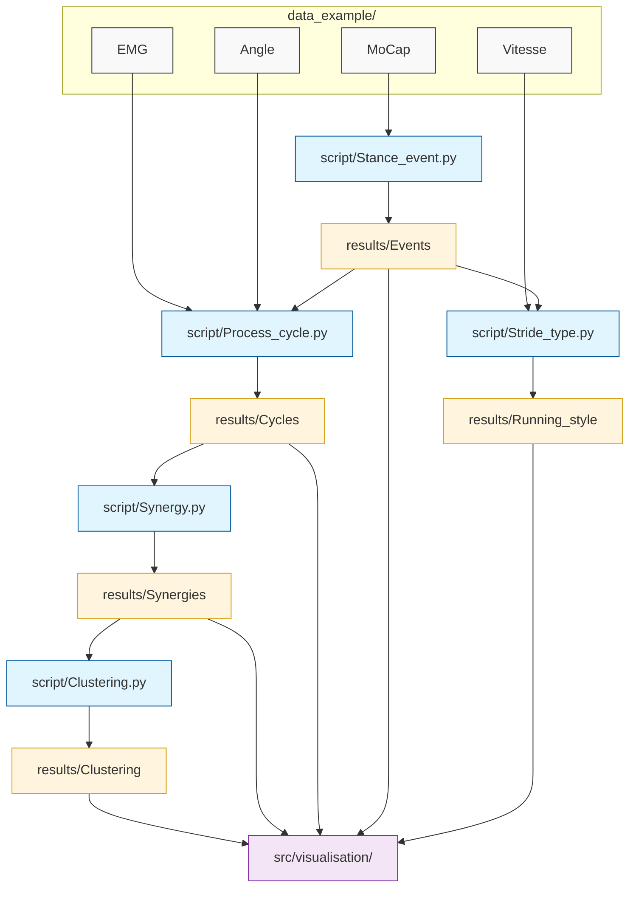

# STRIDE-BY-STRIDE GAIT ANALYSIS TOOLKIT

**Author:** Julien Barbetti  
**Context:** Biomechanics Research  
**Version:** 1.1.0  
**Date:** 2025-2026  

---

## 1. PROJECT OVERVIEW

This repository provides a modular pipeline for the **stride-by-stride analysis of human locomotion**. It handles everything from raw signal processing to muscle/kinematic synergy extraction and hierarchical clustering.

### Key scientific features:
- EMG & Kinematic signal processing  
- Automatic Gait Event detection (HS, TO)  
- Stride Type classification (Van Oevoren 2024)  
- Synergy extraction via NMF & Constrained Clustering  

---

## 2. DIRECTORY STRUCTURE

```text
E:.
│   config.py                 # Global paths and parameter settings
├── data_example              # Raw CSV data (EMG, Angle, MoCap, Speed)
├── results                   # Processed outputs (.pkl and .csv)
│   ├── Clustering            # Final clustered synergies
│   ├── Cycles                # Segmented data per gait cycle
│   ├── Events                # Detected stance/swing events
│   ├── Running_style         # Stride Type results (Van Oevoren 2024)
│   └── Synergies             # Extracted NMF modules (M and P)
├── src                       # Source code
│   ├── core                  # Internal engines (Math, NMF, Clustering)
│   ├── module                # High-level task orchestrators
│   ├── script                # Executable analysis scripts
│   └── visualisation         # Plotting tools for analysis
```

---

## 3. EXECUTION PIPELINE (STEP-BY-STEP)

To perform a complete analysis, run the scripts in this specific order:

### Step 1: Event Detection
```bash
python src/script/Stance_event.py
```
Identifies gait cycles and timing events (Heel Strike, Toe Off).

### Step 2: Stride Type Analysis
```bash
python src/script/Stride_type.py
```
Classifies the running style (e.g., Duty Factor × Stride Length).

### Step 3: Signal Processing
```bash
python src/script/Process_cycle.py
```
Filters and segments raw data into individual strides.

### Step 4: Synergy Extraction
```bash
python src/script/Synergy.py
```
Performs NMF to decompose signals into Spatial/Temporal modules.

### Step 5: Clustering
```bash
python src/script/Clustering.py
```
Groups synergies into global clusters across the dataset.

---

## 4. VISUALIZATION TOOLS

Scripts located in `src/visualisation/`:

- `visu_running_style.py` → Plot running style (e.g., Duty Factor × Stride Length)  
- `visu_synergy.py` → View extracted synergies (muscle or joint)  
- `visu_cluster.py` → View mean synergy of selected cluster  
- `visu_gait_event.py` → Check cycle detection accuracy  

---

## 5. CORE METHODOLOGY

- **Stride Classification:** Based on kinematic markers to distinguish running style  
- **Signal Processing:** Butterworth filtering, RMS, and time-normalization  
- **Decomposition:** NMF (Non-negative Matrix Factorization)  
- **Clustering:** Hierarchical Agglomerative Clustering with a hard cycle-overlap constraint  

## 6. FUNCTIONAL WORKFLOW



**END OF README**
